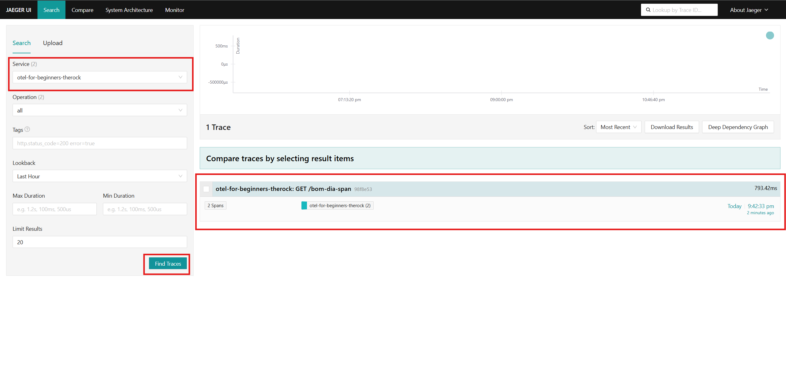
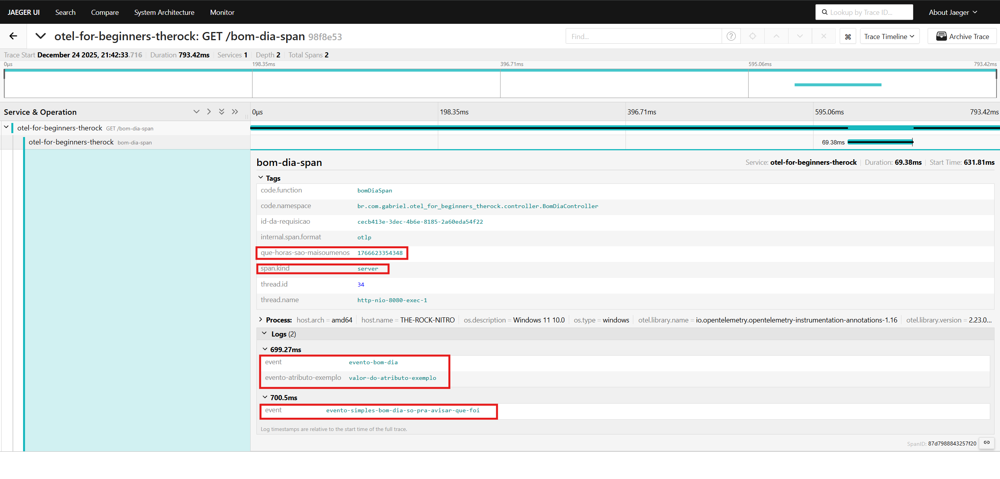
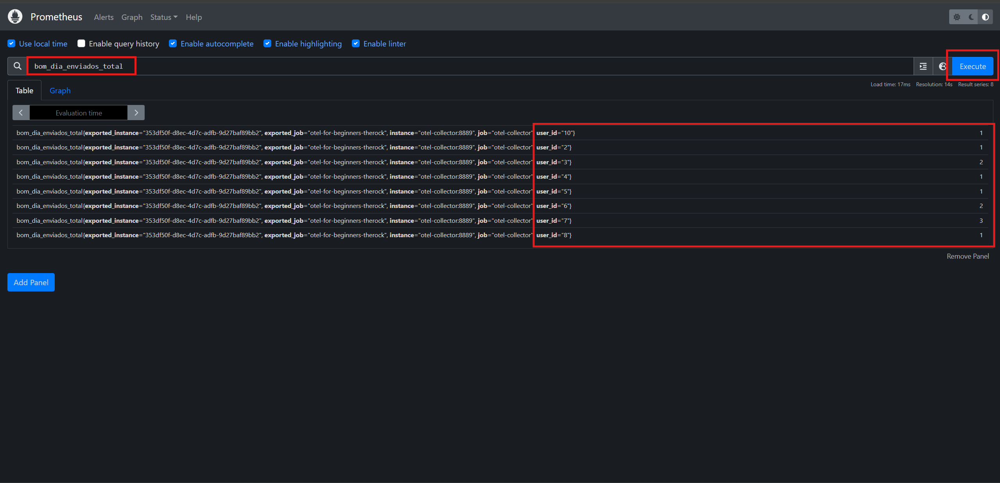

otel-for-beginners/README.md
# OpenTelemetry para iniciantes

Este repositório contém uma coleção de recursos, tutoriais e exemplos para ajudar iniciantes a entender e implementar o OpenTelemetry em suas aplicações. O OpenTelemetry é uma estrutura de observabilidade que fornece ferramentas para coletar, processar e exportar dados de telemetria, como métricas, logs e rastreamentos distribuídos.

## Links Úteis
- [Documentação Oficial do OpenTelemetry](https://opentelemetry.io/docs/)

## Por onde começar
1. **Conceitos**: Entenda o que são essas coisas:
   - Rastreamento Distribuído (Distributed Tracing) com Spans e Traces
     - Aqui, presta atenção na diferença entre Span e Trace, e o que são Events dentro de um Span: onde e quando usá-los da melhor forma.
   - Métricas (Metrics) e qual a sua importância e ganho para monitoramento e NEGÓCIO
2. **Componentes do OpenTelemetry**:
   - SDKs e APIs
   - Collector
   - Exportadores (Exporters)
     - Aqui estão os principais: Jaeger, Prometheus, Loki, OTLP, etc.
3. Sugiro também pedir ajuda ao ChatGPT porque me ajudou muito.

## Principais conceitos (resumo)
- **Rastreamento Distribuído**: Técnica para monitorar solicitações à medida que elas se propagam por diferentes serviços.
- **Métricas**: Dados quantitativos que medem o desempenho e a saúde de um sistema.
- **Logs**: Registros de eventos que ocorrem dentro de um sistema.
- **Instrumentação**: Processo de adicionar código para coletar dados de telemetria.
- - **Collector**: Componente que coleta, processa e exporta dados de telemetria de várias fontes.
- **Exportadores**: Componentes que enviam dados coletados para sistemas de backend, como Jaeger, Prometheus, etc.
- **SDKs e APIs**: Bibliotecas fornecidas pelo OpenTelemetry para facilitar a instrumentação de aplicações.

## Exemplo de Arquitetura do OpenTelemetry em ASCII

```
+------------------+
|   Application    |
| (Spring Boot,    |
|  etc...)         |
+--------+---------+
         |
         |  OTLP (gRPC / HTTP)
         v
+------------------+
| OpenTelemetry    |
| Collector        |
+--------+---------+
         |
         | fan-out
         |
   +-----+-----+-----------+
   |           |           |
   v           v           v
+------+   +----------+   +------+
|Jaeger|   |Prometheus|   | Loki |
|Traces|   | Metrics  |   | Logs |
+------+   +----------+   +------+
```

## Como rodar esse projeto
1. Clone + docker-compose up:
   ```bash
    git clone https://github.com/gabrieltherock/otel-for-beginners-therock.git
    cd otel-for-beginners-therock
    docker-compose up -d
    ```
2. Aguarde os serviços iniciarem (pode levar alguns minutos na primeira vez).
3. Rode a aplicação de exemplo dessa forma no terminal (usamos o a forma "javaagent" para adicionar o agente do OpenTelemetry):
   ```bash
   mvn clean install
   java -javaagent:opentelemetry\opentelemetry-javaagent.jar -jar target\otel-for-beginners-therock-0.0.1-SNAPSHOT.jar
   ```
    OBS: o que é a flag `-javaagent`? Veja [aqui](https://opentelemetry.io/docs/zero-code/java/agent/getting-started/).
4. Chame a aplicação de exemplo para gerar dados de telemetria:
   ```bash
   curl http://localhost:8080/bom-dia
   curl http://localhost:8080/bom-dia-span
   curl http://localhost:8080/bom-dia-metric
   ```
5. Acesse os serviços e comece a explorar:
   - Jaeger UI: [http://localhost:16686](http://localhost:16686) --> Ele mostra os rastreamentos distribuídos (traces)
   - Prometheus UI: [http://localhost:9090](http://localhost:9090) --> Ele mostra as métricas coletadas (metrics)
   - Grafana UI: [http://localhost:3000](http://localhost:3000) (usuário: `admin`, senha: `admin`) --> Ele mostra dashboards prontos com as métricas do Prometheus
   - Loki UI: Não há uma UI dedicada, mas você pode ver os logs via Grafana (adicionando o datasource Loki)
     - Vá em Grafana -> Configuration (engrenagem) -> Data Sources -> Add data source -> Escolha Loki -> URL: `http://loki:3100` -> Save & Test

## Detalhamento dos exportedores usados nesse projeto
- **Jaeger**: Usado para visualizar rastreamentos distribuídos. Ele ajuda a identificar gargalos de desempenho e entender o fluxo de solicitações através de serviços.
  - Quando você acessa a URL do Jaeger, você pode procurar por serviços chamados `otel-for-beginners-therock` para ver os rastreamentos gerados pela aplicação de exemplo.
  - Cada solicitação feita à aplicação (como as chamadas `curl` mencionadas acima) gera um novo rastreamento que pode ser visualizado no Jaeger.
  - Assim que você fizer algumas chamadas à aplicação, vá para a interface do Jaeger, selecione o serviço `otel-for-beginners-therock` e clique em "Find Traces" para ver os rastreamentos gerados. (dê um F5 na página se não aparecer nada na primeira vez)
  - Imagem de exemplo do Jaeger UI:
    
    
- **Prometheus**: Usado para coletar e armazenar métricas. Ele permite monitorar a saúde e o desempenho da aplicação ao longo do tempo.
  - Para ver as métricas coletadas, vá em http://localhost:9090 e use a barra de consulta para buscar nossa métricas personalizada `bom_dia_requests_total`.
  - Internamente, se você quiser ver todas as métricas coletadas por debaixo dos panos, você pode ir aqui: http://localhost:8889/metrics (essa é a porta do OpenTelemetry Collector que expõe as métricas no formato Prometheus).
  - Imagem de exemplo do Prometheus UI:
    
- **Loki**: Usado para coletar e armazenar logs. Ele facilita a busca e análise de logs gerados pela aplicação.